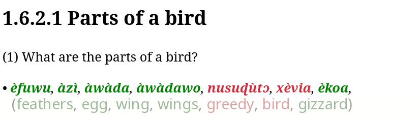

# GUIDE: Creating Semantic Domain Dictionaries for Low-Resource Languages

[](https://github.com/janetzki/GUIDE/issues)
[](CONTRIBUTING.md)
[](https://opensource.org/licenses/MIT)

Code
for [GUIDE: Creating Semantic Domain Dictionaries for Low-Resource Languages](https://aclanthology.org/2024.sigtyp-1.2/),
published at SIGTYP 2024.

## Our presentation
<div align="center">

[](https://youtu.be/iENx7nyr5cs)
(Click to open the YouTube video) (11:26 min)
</div>

## Overview



Existing (black) semantic domain dictionary entries in [FLEx](https://software.sil.org/fieldworks/flex) and correct
(green) and incorrect (red) new predictions: The upper image shows three entries that GUIDE added to the English
dictionary and the lower
image shows seven entries for the same semantic domain question in the newly created Mina-Gen dictionary.


## Requirements

You need the [Conda](https://docs.conda.io/en/latest/) package manager to install the requirements.
Furthermore, you
need [Git LFS](https://docs.github.com/en/repositories/working-with-files/managing-large-files/installing-git-large-file-storage)
to setup the repository.
To install the requirements:

```setup
chmod +x setup.sh
./setup.sh
```

This setup has been tested on an ASUS machine
ESC8000 G4 with Ubuntu 22.04.

## Preprocessing Pipeline

You can skip the preprocessing and directly start to train the model by using the prepared file `final_mag.cpickle`.
(MAG stands for "Multilingual Alignment Graph".)
If you want to reproduce the preprocessing, run:

```preprocess
conda activate guide_env
python -m src.preprocess --output-directory data/0_state/ && python -m src.gnn.refine_mag --input-mag-directory data/0_state/ --output-mag-file final_mag.cpickle
```

Note that the preprocessing does not include the Igbo and Gen-Mina languages because the source Bible translations are
copyrighted.

## Training

To train GUIDE, run this command:

```train
conda activate guide_env
CUDA_VISIBLE_DEVICES=0 python -m src.gnn.train --input-mag-file final_mag.cpickle --output-model-file my_trained_model.bin --output-data-split-file my_data_split.bin
```

## Evaluation

To evaluate GUIDE, run:

```eval
conda activate guide_env
CUDA_VISIBLE_DEVICES=0 python -m src.gnn.eval --input-mag-file final_mag.cpickle --input-model-file my_trained_model.bin --input-data-split-file my_data_split.bin --output-results-file my_results.json
```

The data split file and model file will be created during training.

## Pre-trained Model

`model.bin` contains the pretrained model, trained with a batch size of 6,000, a learning rate of 0.05, and early
stopping patience after 5 epochs with a warmup of 30 epochs.

## Results

Our work establishes a new benchmark for linking words to their semantic domain questions. To the best of our knowledge,
we propose the first automated approach to address this task.

| **Evaluation/Language** | **Precision**               | **Recall**        | **F1**            | **Manual Precision** | **# Predicted links** |
|-------------------------|-----------------------------|-------------------|-------------------|----------------------|-----------------------|
|                         | **Evaluation with dataset** |                   |                   | **Manual**           |                       |
| **Random baseline**     | 0.00                        | 0.500             | 0.000             | n/a                  | 741,033,563           |
|                         |                             |                   |                   |                      |                       |
| **DEVELOPMENT**         |                             |                   |                   |                      |                       |
| Bengali                 | 0.22 ± 0.11                 | 0.002 ± 0.001     | 0.004 ± 0.003     | 0.56                 | 2,809 (2,770)         |
| Chinese (simplified)    | 0.17 ± 0.02                 | 0.014 ± 0.002     | 0.026 ± 0.004     | 0.34                 | 5,752 (5,036)         |
| English                 | **0.63** ± 0.02             | **0.125** ± 0.006 | **0.208** ± 0.009 | **0.86**             | 7,119 (2,314)         |
| French                  | 0.59 ± 0.03                 | 0.097 ± 0.005     | 0.167 ± 0.008     | 0.78                 | 6,993 (2,527)         |
| Hindi                   | 0.25 ± 0.02                 | 0.029 ± 0.003     | 0.051 ± 0.006     | 0.78                 | 3,914 (2,835)         |
| Indonesian              | 0.34 ± 0.05                 | 0.035 ± 0.005     | 0.064 ± 0.009     | 0.77                 | 1,799 (1,068)         |
| Kupang Malay            | 0.14 ± 0.05                 | 0.013 ± 0.005     | 0.024 ± 0.009     | 0.79                 | 1,440 (1,351)         |
| Malayalam               | 0.10 ± 0.03                 | 0.015 ± 0.004     | 0.026 ± 0.007     | 0.43                 | 2,768 (2,480)         |
| Nepali                  | 0.20 ± 0.01                 | 0.022 ± 0.002     | 0.039 ± 0.004     | 0.38                 | 2,641 (2,156)         |
| Portuguese              | 0.43 ± 0.02                 | 0.088 ± 0.006     | 0.146 ± 0.009     | **0.86**             | 6,759 (3,737)         |
| Spanish                 | 0.59 ± 0.02                 | 0.090 ± 0.005     | 0.155 ± 0.008     | 0.84                 | **7,614** (3,579)     |
| Swahili                 | 0.33 ± 0.04                 | 0.018 ± 0.003     | 0.033 ± 0.005     | 0.75                 | 2,320 (2,020)         |
|                         |                             |                   |                   |                      |                       |
| **TEST**                |                             |                   |                   |                      |                       |
| German                  | n/a                         | n/a               | n/a               | 0.67                 | **5,022**             |
| Hiri Motu               | n/a                         | n/a               | n/a               | 0.62                 | 1,190                 |
| Igbo                    | n/a                         | n/a               | n/a               | 0.45                 | 1,405                 |
| Mina-Gen                | n/a                         | n/a               | n/a               | **0.80**             | 3,063                 |
| Motu                    | n/a                         | n/a               | n/a               | 0.32                 | 2,731                 |
| South Azerbaijani       | n/a                         | n/a               | n/a               | 0.58                 | 2,238                 |
| Tok Pisin               | n/a                         | n/a               | n/a               | 0.69                 | 880                   |
| Yoruba                  | n/a                         | n/a               | n/a               | 0.63                 | 2,637                 |
|                         |                             |                   |                   |                      |                       |
| **AVERAGES**            |                             |                   |                   |                      |                       |
| Development set         | 0.33 ± 0.04                 | 0.046 ± 0.004     | 0.079 ± 0.007     | 0.68 ± 0.19          | 4,327 ± 2,338         |
| Test set                | n/a                         | n/a               | n/a               | 0.60 ± 0.15          | 2,396 ± 1,324         |
| Stanza                  | **0.43** ± 0.02             | **0.068** ± 0.005 | **0.117** ± 0.008 | **0.74** ± 0.17      | **5,622** ± 1,975     |
| SentencePiece           | 0.21 ± 0.05                 | 0.014 ± 0.003     | 0.026 ± 0.005     | 0.53 ± 0.13          | 2,364 ± 524           |
| Punctuation mark split  | 0.14 ± 0.05                 | 0.013 ± 0.005     | 0.024 ± 0.009     | 0.64 ± 0.18          | 1,990 ± 927           |
| Total                   | 0.33 ± 0.04                 | 0.046 ± 0.004     | 0.079 ± 0.007     | 0.65 ± 0.18          | 3,555 ± 2,180         |

## Contributing

If you would like to contribute, find bugs, or have any suggestions for this project, you can contact me
at [jonathan.janetzki@student.hpi.de](mailto:jonathan.janetzki@student.hpi.de) or open an issue on this GitHub
repository.

All contributions are welcome. All content in this repository is licensed under the MIT License.